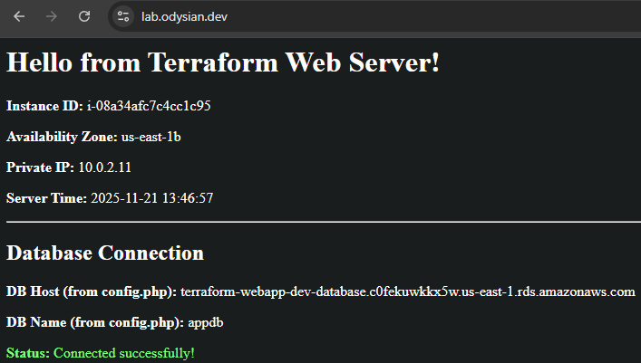

# AWS Terraform Infrastructure

## Overview

Terraform-based rebuild of my earlier AWS CloudWatch monitoring and incident-response labs. 

It shifts the focus toward production-style patterns: modular design, separate environments, secrets management, hardened security, and automated scaling. 

My goal is to deepen my operational fluency while learning through hands-on iterative projects.

This project provisions a full 3-tier web application using Terraform, with production-style operational controls.

For detailed architecture, implementation rationale, and operational considerations, see:
- [`docs/ARCHITECTURE.md`](docs/ARCHITECTURE.md)
- [`docs/SECURITY.md`](docs/SECURITY.md)
- [`docs/TESTING.md`](docs/TESTING.md)

## Key Features:

### Core Infrastructure
- VPC with public/private subnets and route tables  
- Application Load Balancer (HTTPS, TLS, HTTP → HTTPS redirect)
- Auto Scaling Group with CPU‑based scaling policies 
- Secrets Manager integration for runtime DB credentials
- RDS MySQL with encryption, backups, logs to CloudWatch, and custom parameter group
- IMDSv2 enforced on EC2 instances 

### Security Enhancements
- AWS WAF Web ACL attached to the ALB 
- Security group separation:
  - ALB SG (ingress from internet → ALB)
  - Web SG (ingress only from ALB → EC2)
  - DB SG (ingress only from Web SG → MySQL)
- TLS termination with ACM on `lab.odysian.dev`
- Account‑level CloudTrail trail logging to encrypted S3
- ALB access logging

### Operational Hardening
- S3 remote state + DynamoDB locking per environment  
- GitHub Actions CI pipeline enforcing fmt/validate/plan for dev and prod 
- CloudWatch dashboard + alarms for ALB, EC2, and RDS  
- CloudWatch Agent installed via user data  
- ASG updates via Launch Template versioning
- S3 lifecycle and encryption policies

### Application Behavior
User data performs the following at boot:
1. Installs httpd, PHP, CloudWatch agent, and required packages  
2. Retrieves AWS region from IMDSv2  
3. Fetches DB credentials from Secrets Manager  
4. Writes `config.php` and an operational `index.php`  
5. Creates `health.html` for the ALB target group  
6. Ensures SSM agent is installed and enabled (post‑AMI regression fix)  

This creates a simple dynamic PHP application that displays:
- EC2 metadata (IMDSv2)  
- Database connection status  
- MySQL version and server time



## Repository Structure

```
aws-terraform-infrastructure/
├── modules/
│   ├── networking/
│   ├── compute/
│   ├── database/
│   ├── monitoring/
│   ├── waf/
│   └── security/
├── envs/
│   ├── dev/
│   └── prod/
├── scripts/
│   ├── user_data_v2.sh
│   └── user_data.sh
└── docs/
    ├── ARCHITECTURE.md
    ├── SECURITY.md
    ├── TESTING.md
    └── images/
```

## Secrets Management (High Level)

- Application DB credentials are stored in AWS Secrets Manager and fetched at boot by the EC2 instances via IAM.
- The app uses a dedicated, least-privilege DB user.
- Credentials never appear in Terraform state or user data.
- If RDS is recreated, the app user must be recreated to match the existing secret.

### EC2 Runtime Integration

The launch template injects the secret ARN into user data.  
User data fetches and parses the secret:

```bash
aws secretsmanager get-secret-value   --secret-id "$DB_SECRET_ARN"   --query 'SecretString' --output text
```

## Multi‑Environment Workflow

The repository uses separate environments with isolated states:

```
envs/dev/  → dev.tfstate
envs/prod/ → prod.tfstate
```

Each environment has its own:
- RDS instance
- ALB and ASG
- Secrets Manager ARN
- Domain configuration

Terraform Cloud is not used: everything is deployed via local CLI and GitHub Actions CI.

## Key Learnings

### Terraform
- Implemented a thin‑root, modular architecture.
- Gained fluency passing outputs → module inputs across layers.  
- Adopted S3 + DynamoDB for remote state and locking.  
- Used Launch Template versioning + create_before_destroy for safe rolling replacements.  
- Learned to diagnose plan/destroy failures related to:
  - S3 versioned buckets
  - RDS deletion protection

### AWS Operations
- Debugged RDS connectivity issues caused by incorrect SG wiring after modularization.  
- Understood CPU bursting and scaling behavior on t3.micro instances.  
- Identified root cause when SSM agent became unavailable due to a new AMI without SSM preinstalled.  
- Implemented an explicit SSM agent install in user data to avoid AMI regressions. 

### Security Practices
- Implemented least‑privilege app user pattern for RDS.  
- Enforced IMDSv2 and restricted SG relationships.  
- Added WAF with managed rule groups.  
- Hardened TLS via explicit ALB SSL policy.  
- Ensured all logs (ALB, CloudTrail, RDS) go to S3/CloudWatch. 

## Related Labs

- **Week 1:** CloudWatch Monitoring  
  https://github.com/odysian/aws-cloudwatch-monitoring  
- **Week 2:** Incident Response Lab  
  https://github.com/odysian/aws-incident-response-lab  
- **Week 3:** Terraform Infrastructure (this repo)  
