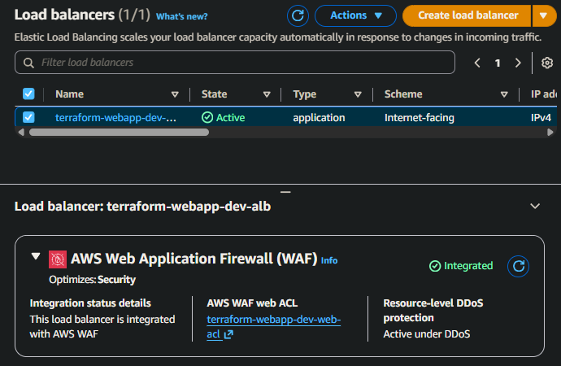

# Security Overview

This document covers the primary security controls and highlights areas for future hardening.

## Scope

- Single AWS account (learning/lab environment)
- Terraform runs from trusted workstation
- Focus: network boundaries, secrets management, logging

## Network Security

**VPC Design**
- Public subnets: ALB and EC2 instances
- Private subnets: RDS only (no internet route)
- Internet Gateway with public route table

**Security Groups**
- **ALB SG:** HTTP/HTTPS from internet → ALB
- **Web SG:** HTTP from ALB SG only (no direct internet access)
- **DB SG:** MySQL 3306 from Web SG only
- Remote access via SSM Session Manager (no SSH)

**WAF Protection**
- Web ACL attached to ALB (REGIONAL scope)
- AWS managed rule groups:
  - Common Rule Set
  - Known Bad Inputs
  - SQL Injection
- Metrics and sampled requests sent to CloudWatch



## Instance Hardening

**IMDSv2 Enforcement**
- `http_tokens = "required"`
- `http_endpoint = "enabled"`
- `http_put_response_hop_limit = 1`
- Application uses IMDSv2 to read instance metadata

**Access Control**
- No SSH key pairs or port 22 rules
- Management via AWS Systems Manager (SSM)

## IAM

**EC2 IAM Role**
- Managed policies:
  - `AmazonSSMManagedInstanceCore`
  - `CloudWatchAgentServerPolicy`
- Inline policy for Secrets Manager:
  - `Action: secretsmanager:GetSecretValue`
  - `Resource: <db-credentials-secret-arn>` (least privilege)

## TLS Configuration

**ALB TLS Termination**
- ACM certificate for `lab.odysian.dev`
- SSL policy: `ELBSecurityPolicy-TLS13-1-2-2021-06` (AWS-managed)
- Client ↔ ALB: HTTPS (encrypted)
- ALB ↔ EC2: HTTP inside VPC

## Secrets Management

**AWS Secrets Manager Integration**
1. Secret created outside Terraform (CLI/console) with JSON:
   ```json
   {"username": "...", "password": "...", "dbname": "..."}
   ```
2. Secret ARN passed to Terraform as variable
3. EC2 IAM role granted `GetSecretValue` permission
4. User data fetches secret at boot and writes `config.php`
5. Application uses constants from `config.php`

**Security Benefits**
- Credentials never in Terraform state or user data
- Runtime-only access via IAM
- Least-privilege DB user (not RDS master)

**Future Hardening**
- Automated secret rotation
- Custom KMS key with restricted policy

## Database Security

**RDS Hardening**
- Storage encrypted at rest (KMS)
- Automated backups (1-day retention)
- Deletion protection enabled
- Custom parameter group for slow query logging

**Network Access**
- Deployed in private subnets
- Only accessible from Web SG on port 3306

**Application Access**
- Dedicated least-privilege user (SELECT, INSERT, UPDATE, DELETE)
- RDS master user reserved for administrative tasks via SSM

## Logging & Monitoring

**CloudWatch**
- Metrics and alarms for ASG, ALB, RDS
- RDS log exports: `error`, `general`, `slowquery`
- CloudWatch agent for instance-level metrics
- SNS email notifications

**ALB Access Logs**
- Written to encrypted S3 bucket
- 30-day lifecycle rule
- Public access blocked
- Bucket policy allows ELB service account only

**Account-Level Logging**
- CloudTrail trail: `account-trail-terraform-webapp-env`
- Multi-region, log file validation enabled
- Logs to encrypted S3 bucket
- Bucket policy allows CloudTrail service only

## Terraform State Security

**Remote State**
- S3 bucket with encryption and versioning
- DynamoDB table for state locking
- Access limited to Terraform IAM identity and CI role

**Considerations**
- State contains ARNs and identifiers
- Treat state bucket as sensitive

## Known Gaps & Future Work

**Intentionally out-of-scope:**
- Stricter egress controls on web instances
- Formal patching strategy (SSM Patch Manager)
- Multi-account setup (dev/prod separation)
- GuardDuty (disabled for free-tier)
- Security Hub / AWS Config rules
