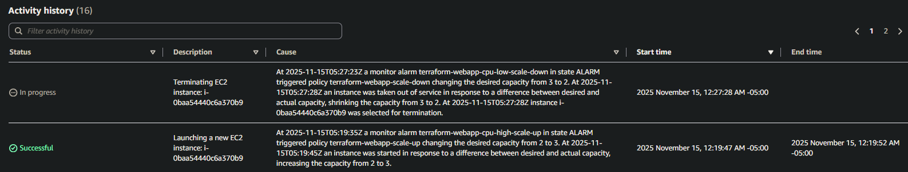
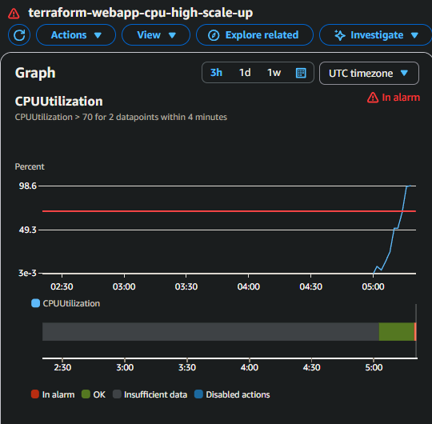
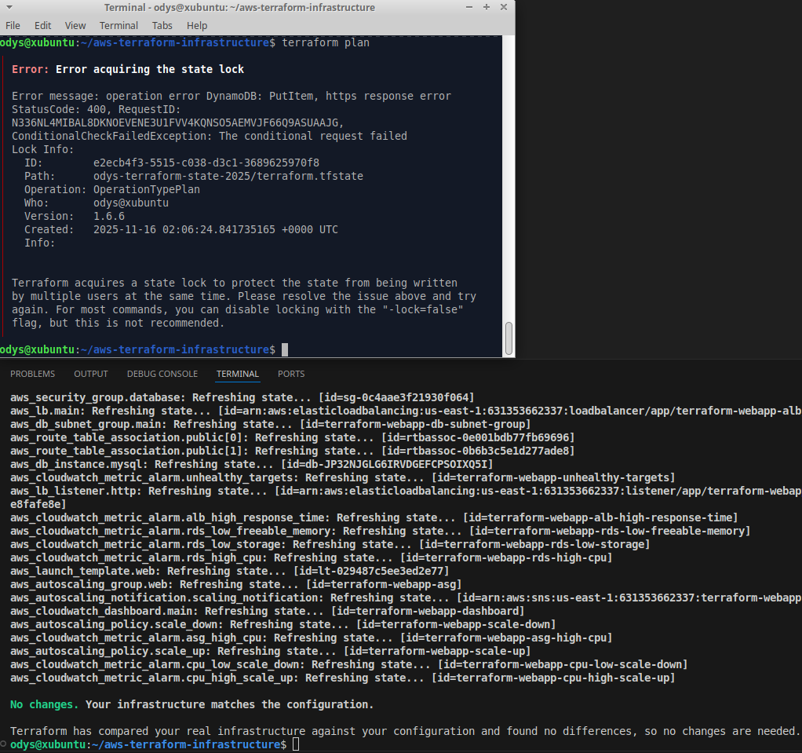
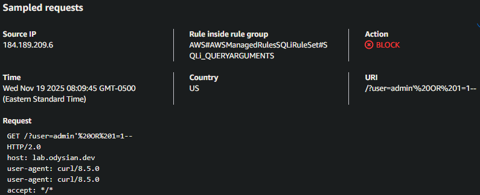
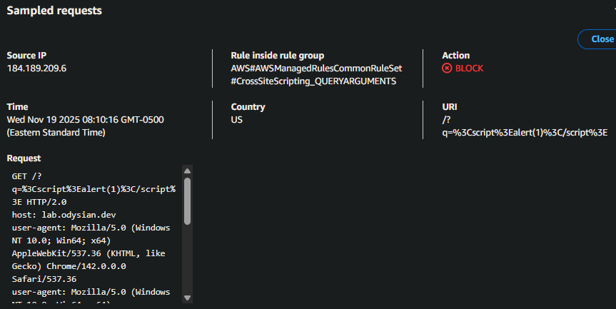

# Testing & Validation

## Auto Scaling

**Test:** Verify CPU-based scaling policies

**Configuration:**
- Desired capacity: 2 instances
- Scale-out: CPU > 70% for 4 minutes
- Scale-in: CPU < 30% for 4 minutes

**Steps:**
1. SSH to both instances via SSM
2. Run stress test:
   ```bash
   stress-ng --cpu 2 --cpu-load 90 --timeout 600s
   ```
3. Observe high-CPU alarm trigger and 3rd instance launch
4. Stop `stress-ng` and observe low-CPU alarm
5. Confirm ASG terminates extra instance after cooldown



## Database Connectivity

**Test:** Verify RDS access from web tier

From web instance:
```bash
mysql -h terraform-webapp-dev-database.c0fekuwkkx5w.us-east-1.rds.amazonaws.com -u admin -p
```

**Expected:** Successful login and application reports healthy DB connection

## Load Balancer

**Health Check:**
```bash
curl http://terraform-webapp-dev-alb-1107457006.us-east-1.elb.amazonaws.com/health.html
```
**Expected:** Returns `OK`

**Round-Robin Distribution:**
```bash
for i in {1..10}; do
  curl -s http://terraform-webapp-dev-alb-1107457006.us-east-1.elb.amazonaws.com/ | grep "Instance ID"
done
```
**Expected:** Load distributed across instances

## CloudWatch Alarms

**Test:** Verify alarm state transitions

**Methods:**
- ASG CPU: `stress-ng` (see auto scaling test above)
- Unhealthy targets: Stop Apache on one instance
- RDS metrics: Run heavy queries to trigger CPU/storage alarms

**Expected:**
- Alarms transition between `OK`, `ALARM`, `INSUFFICIENT_DATA`
- SNS email notifications delivered



## Terraform State Locking

**Test:** Verify DynamoDB locking prevents concurrent operations

**Steps:**
1. Run `terraform plan` in first shell
2. Immediately run `terraform plan` in second shell against same environment

**Expected:** Second plan fails with lock error until first completes



## RDS Slow Query Logging

**Test:** Confirm custom parameter group and CloudWatch log exports

**Configuration:**
- `slow_query_log = 1`
- `long_query_time = 2`

**Steps:**
1. Connect to RDS via MySQL client
2. Run test queries:
   ```sql
   CREATE TABLE IF NOT EXISTS slow_test (
       id INT AUTO_INCREMENT PRIMARY KEY,
       padding CHAR(200) NOT NULL,
       created_at TIMESTAMP DEFAULT CURRENT_TIMESTAMP
   );

   INSERT INTO slow_test (padding)
   SELECT REPEAT('x', 200)
   FROM information_schema.tables
   LIMIT 5000;

   SELECT SLEEP(3);
   SELECT * FROM slow_test ORDER BY padding DESC LIMIT 1000;
   ```
3. Check CloudWatch Logs: `/aws/rds/instance/terraform-webapp-dev-database/slowquery`

**Expected:** Entries showing `Query_time > 2` seconds

**Example log entry:**
```
# Time: 2025-11-18T04:04:50.953323Z
# User@Host: admin[admin] @ [10.0.2.86] Id: 14
# Query_time: 3.000274 Lock_time: 0.000000 Rows_sent: 1 Rows_examined: 1
SET timestamp=1763438687;
SELECT SLEEP(3);
```

## WAF Protection

### SQL Injection Test

**Test:** Verify AWS managed SQLi rules block malicious payloads

```bash
curl -k "https://lab.odysian.dev/?user=admin'%20OR%201=1--"
```

**Expected:** HTTP 403 Forbidden (request blocked before reaching application)

**Console Verification:**
1. WAF & Shield → Web ACLs → `terraform-webapp-dev-web-acl`
2. Sampled requests tab → Filter: Action = BLOCK
3. Confirm:
   - Request URI matches SQLi query string
   - Matched rule: `AWS#AWSManagedRulesSQLiRuleSet#SQLi_QUERYARGUMENTS`



### XSS Test

**Test:** Verify common rule set blocks known bad input

```bash
curl "https://lab.odysian.dev/?q=<script>alert(1)</script>" -v
```

**Expected:** HTTP 403 Forbidden

**Console Verification:**
1. Rules tab → `terraform-webapp-dev_waf_common`
2. View sampled requests → Filter: Blocked
3. Confirm payload and source IP appear



## CloudTrail Verification

**Test:** Confirm account-level audit logging is active

**Steps:**
1. CloudTrail → Trails in AWS Console
2. Verify trail: `account-trail-<project_name>`
3. Check S3 bucket: `cloudtrail-logs-<project_name>-<account-id>`
4. Confirm recent log files under `AWSLogs/<account-id>/CloudTrail/...`

## ALB Access Logs

**Viewing on Windows:**
- ALB logs are gzip-compressed in S3
- Windows native extract doesn't handle `.gz` properly
- Use 7-Zip or similar tool

**Viewing on Linux:**
```bash
gunzip -c 631353662337_elasticloadbalancing_...log.gz | head
```

## Troubleshooting Notes

### RDS Connectivity Issue (Post-Modularization)
**Symptom:** 504s from ALB, timeouts from `curl`/`nc` to RDS endpoint

**Root Cause:** RDS using Web SG instead of DB SG after networking module refactor

**Fix:** Corrected DB SG output in networking module and re-applied

**Result:** Application connected successfully to database

### SSM Agent Regression
**Symptom:** New EC2 instances not appearing as managed nodes in Systems Manager and unable to connect through SSM.

**Investigation:**
- Launch Template used `most_recent = true` for Amazon Linux 2023 AMI
- CloudTrail showed AMI ID changed on Nov 17
- New AMI did not include SSM agent by default

**Root Cause:** `data "aws_ami"` silently upgraded to newer AL2023 image without SSM agent preinstalled

**Fix:** Updated user data to explicitly install and enable SSM agent:
```bash
dnf install -y amazon-ssm-agent || true
systemctl enable amazon-ssm-agent
systemctl restart amazon-ssm-agent || systemctl start amazon-ssm-agent
```

**Lesson Learned:** Do not rely on AMI defaults for critical agents. Either pin specific AMI IDs or treat bootstrap scripts as source of truth for required tooling.
